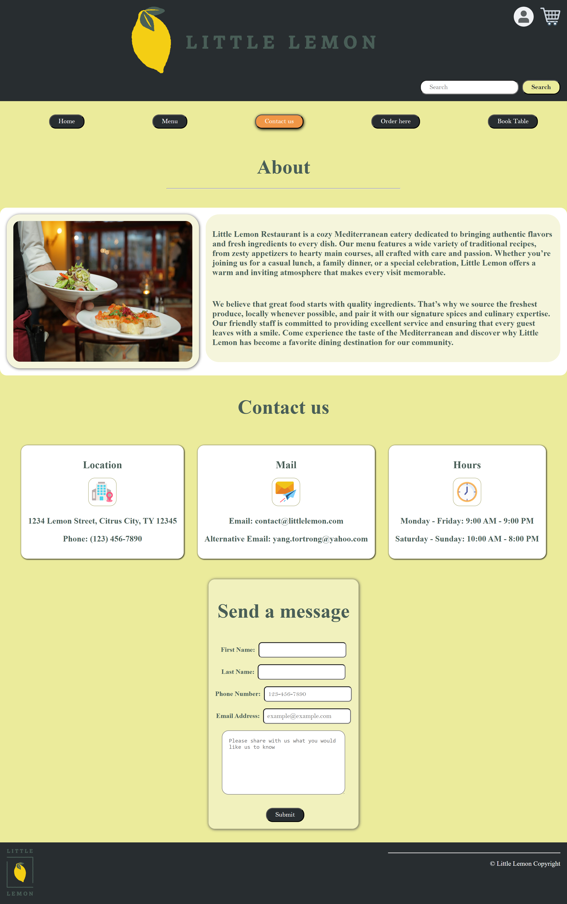

# Little Lemon Restaurant

A responsive React web application that allows customers to browse the menu and reserve a table online.

## Screenshots
### Homepage 

## Live Demo 
View the live site here: 
tyang-littlelemon.vercel.app 

## Features
- Interactive table reservation form
- Dynamic time slot selection
- Client-side form validation
- Accessible semantic HTML
- Responsive design (mobile, tablet, desktop)
- Booking confirmation page

## Tech Stack
- React
- JavaScript (ES6+)
- HTML5
- CSS3

## What I Learned
- Managing state in React using hooks
- Implementing controlled form components
- Handling form validation logic
- Building accessible UI components
- Deploying a React app using Vercel

## Installation
1. Clone the repository
2. Install dependencies:
   npm install
3. Start the development server:
   npm start
4. Open http://localhost:3000 in your browser

## Acknowledgements
This project was completed as part of the Meta Front-End Developer Professional Certificate on Coursera.
